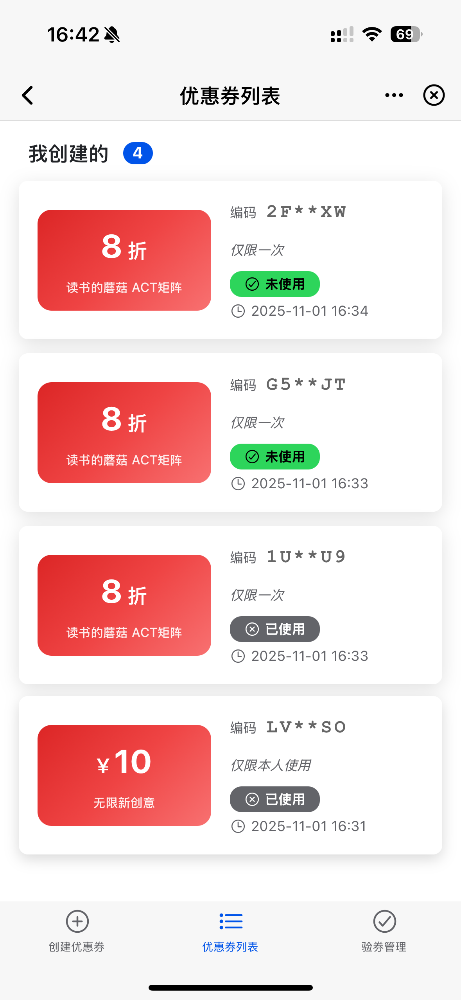

# 🌟 Awesome MorphixAI Apps

> Curated collection of MorphixAI applications - Fast development, unified management

<div align="center">

[](https://github.com/Morphicai/awesome-morphix-apps)
[](LICENSE)

[](https://x.com/MorphixAI)
[](https://discord.gg/HTknmpUM)
[](https://www.reddit.com/r/MorphixAI/)

[中文](README_CN.md) | [한국어](README_KR.md) | [日本語](README_JA.md)

</div>

## 📖 Project Overview

This is a **MorphixAI applications collection management project** for unified management of multiple high-quality MorphixAI applications.

### ✨ Core Features

- 🚀 **Quick Creation** - One-click creation of new application projects
- 🎯 **Unified Management** - Centralized management of all applications and dependencies
- 🛠️ **Development Tools** - Complete CLI toolchain support

### 🔗 Relationship with @morphixai/code

This project uses [@morphixai/code](https://github.com/Morphicai/morphixai-code) as the underlying framework for creating MorphixAI applications. The `@morphixai/code` package provides:

- Application templates and scaffolding
- Development environment setup
- Build and deployment tools
- MorphixAI platform integration

For detailed documentation about the framework, visit the [official @morphixai/code repository](https://github.com/Morphicai/morphixai-code).

## 📚 Available Applications

| Name | Description | Author | Features | Screenshot | Demo | Details |
|------|-------------|--------|----------|------------|------|---------|
| ⏰ **timer** | Pomodoro Timer Application - Task management + Pomodoro technique | MorphixAI Team | • Task management system<br>• Pomodoro timer<br>• Data statistics<br>• Multi-language support (EN/CN) |  | [Live Demo →](https://app-shell.focusbe.com/app/1219e970-e531-4157-bce9-e8f4dcaaf6a6#/) | [View Details →](https://github.com/Morphicai/awesome-morphix-apps/blob/main/apps/timer/README.md) |
| 📊 **mermaid** | Mermaid Diagram Editor - Create and edit various diagrams | MorphixAI Team | • Multiple diagram types<br>• Version management<br>• Real-time preview<br>• Export capabilities |  | [Live Demo →](https://app-shell.focusbe.com/app/244975ac-609a-4a12-a02f-88d1512e9b60) | [View Details →](https://github.com/Morphicai/awesome-morphix-apps/blob/main/apps/mamerid/README.md) |
| 🤔 **Million Questions AI** | AI-powered business idea analysis and decision support tool | MorphixAI Team | • Golden question list generation<br>• AI mentor recommendations<br>• Action blueprints<br>• Virtual board of directors<br>• Share to social media |  | [Live Demo →](https://app-shell.focusbe.com/app/百万问ai-287d31ea-74d9-4cb4-9c48-37857d099358#/) | [View Details →](https://github.com/Morphicai/awesome-morphix-apps/blob/main/apps/million-questions-ai/README.md) |
| 💪 **fitness** | Fitness Assistant - Workout planning and tracking application | MorphixAI Team | • Create workout plans<br>• Exercise tracking<br>• Calendar scheduling<br>• Statistics dashboard<br>• Multi-language support |  | [Live Demo →](https://app-shell.focusbe.com/app/ac5ba95d-a32c-4802-af26-e5f228c035ca) | [View Details →](https://github.com/Morphicai/awesome-morphix-apps/blob/main/apps/fitness/README.md) |
| 🔮 **soul-code-interpretation** | Soul Code Interpretation - Enneagram test and soul analysis app | MorphixAI Community | • Enneagram personality test<br>• Zodiac analysis<br>• AI intelligent insights<br>• Energy value calculation<br>• Growth trajectory tracking |  | [Live Demo →](#) | [View Details →](https://github.com/Morphicai/awesome-morphix-apps/blob/main/apps/soul-code-interpretation/README.md) |
| 🎫 **code-manager** | Coupon Management System - Create, validate and manage coupons | MorphixAI Team | • Create single/batch coupons<br>• QR code validation<br>• Image generation<br>• Cloud storage<br>• Tab-based navigation |  | [Live Demo →](https://app-shell.focusbe.com/app/d7d89e52-858c-4d73-9327-42a646afc12b) | [View Details →](https://github.com/Morphicai/awesome-morphix-apps/blob/main/apps/code-manager/README.md) |

> 📝 **Note**: Demo links use the format `https://app-shell.focusbe.com/app/{remoteId}`

## 📁 Project Structure

> 🎯 Based on pnpm monorepo architecture for unified management of all applications and tools

```
awesome-morphix-apps/
├── apps/                  # 📱 All applications
│   └── timer/             # ⏰ Pomodoro Timer application
│       ├── src/app/       # Task management + Pomodoro functionality
│       ├── src/_dev/      # Development environment shell
│       └── docs/          # Project documentation
│
├── tools/                 # 🛠️ Development tools
│   └── cli/               # CLI toolkit
│       ├── bin/
│       │   └── morphix.js # Unified CLI entry point
│       ├── create-app.js  # Create new applications
│       ├── sync-docs.js   # Sync documentation
│       └── dev.js         # Development server
│
├── docs/                  # 📚 Shared documentation
│   ├── CONTRIBUTING.md    # Contributing guide
│   └── QUICK_START.md     # Quick start guide
│
├── pnpm-workspace.yaml    # pnpm workspace configuration
├── package.json           # Root project configuration
└── README.md              # This file
```

## 🚀 Quick Start

### Requirements

- **Node.js** 18+ (LTS version recommended)
- **Git**
- Supported OS: macOS, Windows, Linux

> 💡 **No need to install pnpm globally**  
> The project includes pnpm, use `pnpm` commands directly

### Installation

```bash
# Clone repository
git clone git@github.com:Morphicai/awesome-morphix-apps.git
cd awesome-morphix-apps

# Install all dependencies (including all applications and pnpm)
pnpm install
```

## 🛠️ Project Management

### Creating New Applications

Use CLI tools to quickly create new MorphixAI applications:

```bash
# Interactive creation
npm run create

# Or specify application name directly
npm run create my-awesome-app
```

The creation process will:
1. ✅ Use `npx @morphixai/code create` to create the application
2. ✅ Ensure application is created in the `apps/` directory
3. ✅ Automatically generate project structure and configuration
4. ✅ Automatically install dependencies
5. ✅ Initialize development environment

### Developing Applications

**Method 1: Interactive Development (Recommended)**

Run in root directory, displays menu for selection:

```bash
npm run dev
```

Interactive menu supports:
- 📱 Use ↑↓ arrow keys to select applications
- ➕ Create new applications
- ❌ Exit

**Method 2: Direct Project Entry**

```bash
cd apps/timer
pnpm install
npm run dev
```

Browser will automatically open `http://localhost:8812`

## 🎯 Development Guidelines

All applications must follow unified development standards:

### Core Constraints

- ✅ **Development Area**: Only develop within the `src/app/` directory
- ❌ **Prohibited Modifications**: Cannot modify `src/_dev/`, configuration files, and build scripts
- 📦 **Tech Stack**: React 19 + Ionic React 8.6.2
- 🎨 **Styling**: Must use CSS Modules
- 🔒 **Entry Point**: `src/app/app.jsx`

### Recommended Tools

- **Cursor AI** - Built-in complete development standards
- **Claude Code** - Supports natural language programming
- **VS Code** - Works with Vite plugins

## 💡 Case Study: Mermaid Diagram Editor

The **Mermaid** application demonstrates advanced MorphixAI development patterns and showcases how to build complex applications within the framework constraints.

### 🎯 Project Overview

The Mermaid Diagram Editor is a sophisticated application that allows users to create, edit, and export various types of diagrams using the Mermaid syntax. It demonstrates several advanced concepts:

- **Dynamic Module Loading**: Uses `remoteImport` to load different versions of Mermaid
- **Service Architecture**: Implements a robust service layer for version management
- **Caching Strategy**: Intelligent caching of multiple Mermaid versions
- **Error Handling**: Comprehensive error reporting with `@morphixai/lib`

### 🔧 Key Implementation: MermaidService.js

The core of the application is the `MermaidService` class, which manages multiple versions of the Mermaid library:

```javascript
class MermaidService {
    constructor() {
        this.cache = new Map();     // Version cache
        this.loading = new Map();   // Loading state management
    }

    async loadMermaid(version) {
        // 1. Check cache first
        if (this.cache.has(version)) {
            return this.cache.get(version);
        }

        // 2. Load using remoteImport
        const mermaidModule = await remoteImport(`mermaid@${version}`);
        const mermaid = mermaidModule.default || mermaidModule;

        // 3. Initialize and cache
        mermaid.initialize({
            startOnLoad: false,
            theme: 'default',
            securityLevel: 'loose'
        });

        this.cache.set(version, mermaid);
        return mermaid;
    }
}
```

### 🌟 Key Features Demonstrated

1. **Version Management**: Supports multiple Mermaid versions simultaneously
2. **Performance Optimization**: Intelligent caching and preloading
3. **Error Resilience**: Comprehensive error handling and reporting
4. **Resource Management**: Efficient memory usage with cache management

### 🚀 Try It Live

Experience the Mermaid Diagram Editor: [Live Demo →](https://app-shell.focusbe.com/app/244975ac-609a-4a12-a02f-88d1512e9b60)

This case study shows how MorphixAI applications can leverage external libraries while maintaining performance and reliability standards.

## 📦 Publishing Process

### Development Environment Testing

```bash
cd your-app
npm run dev
```

### Publishing to MorphixAI Platform

1. **Method 1: Manual Publishing**
   - Click "Upload Application" in the development environment control panel
   - Fill in application information and submit for review

2. **Method 2: Official Marketplace**
   - Send email to `contact@baibian.app`
   - Provide application information and usage instructions

## 🔧 CLI Commands

### Monorepo Commands

> 💡 Use `npm` for running scripts, `pnpm` for installation

```bash
# 🎯 Interactive development (Recommended)
npm run dev              # Display menu to select project

# Create new application
npm run create [name]

# Sync documentation
npm run sync-docs [app]

# Install all dependencies
pnpm install

# Clean all node_modules
npm run clean
```

### Sub-project Commands

```bash
# 🎯 Recommended: Use interactive command
npm run dev                        # Select project to develop

# Use pnpm filters in root directory
pnpm --filter timer dev            # Develop specific application

# Or enter sub-project
cd apps/timer
pnpm install                       # Install dependencies
npm run dev                        # Start development server
npm run generate-id                # Generate project ID
```

## 🤝 Contributing Guide

Welcome to contribute new applications or improve existing ones!

### Contribution Process

1. Fork this repository
2. Create a new branch for your feature
   ```bash
   git checkout -b feature/my-new-app
   ```
3. Create new application or improve existing ones
   ```bash
   npm run create my-app
   cd apps/my-app
   # Start development...
   ```
4. Commit your changes
   ```bash
   git add .
   git commit -m "feat(my-app): add new application"
   ```
5. Push to your branch
   ```bash
   git push origin feature/my-new-app
   ```
6. Create a Pull Request from your branch to the main branch

### Application Quality Requirements

- ✅ Code follows development standards
- ✅ Provides complete documentation
- ✅ Passes testing in development environment
- ✅ Follows MorphixAI platform constraints
- ✅ Has practical value

## 📖 Related Resources

### Official Documentation
- [MorphixAI Official Website](https://baibian.app/)
- [@morphixai/code Framework](https://github.com/Morphicai/morphixai-code)
- [Application Marketplace](https://app-shell.focusbe.com/app-market)

### Technical Documentation
- [React Official Documentation](https://react.dev/)
- [Ionic React](https://ionicframework.com/docs/react)
- [Vite Documentation](https://vitejs.dev/)

### Community
- GitHub Issues - Bug reports and feedback
- GitHub Discussions - Technical discussions
- Email: contact@baibian.app

### Social Media
- [Twitter/X](https://x.com/MorphixAI) - Latest updates and announcements
- [Discord](https://discord.gg/HTknmpUM) - Community chat and support
- [Reddit](https://www.reddit.com/r/MorphixAI/) - Community discussions
- [小红书 (Xiaohongshu)](https://www.xiaohongshu.com/user/profile/585f9bb150c4b429edd4224e) - Chinese community
- [抖音 (Douyin)](https://v.douyin.com/qr4TImD9qZ0/) - Video content and tutorials

## 📄 License

This project is licensed under the [MIT License](LICENSE).

---

<div align="center">

**Made with ❤️ by MorphixAI Community**

[⬆ Back to Top](#-awesome-morphixai-apps)

</div>

