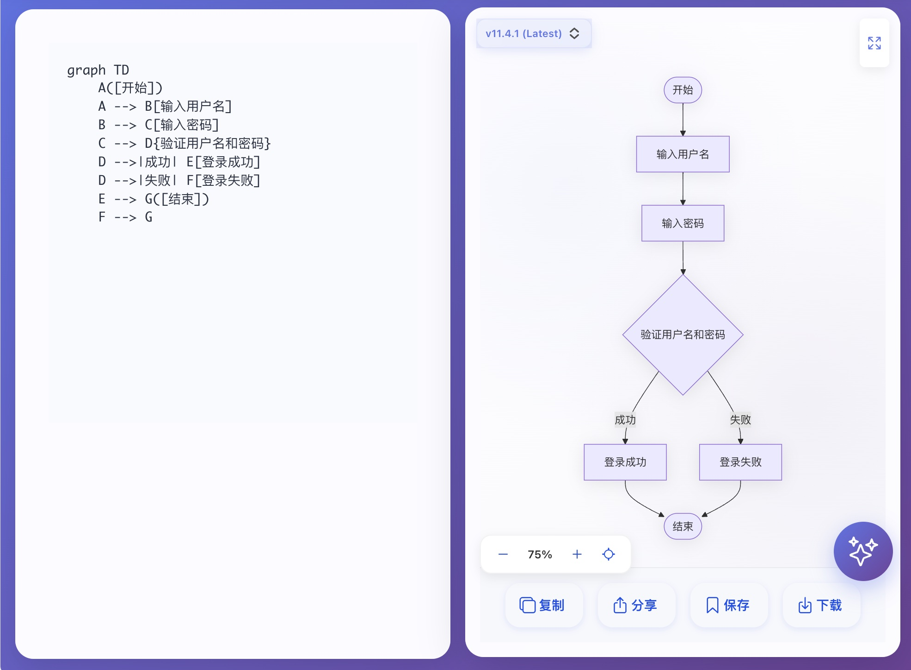
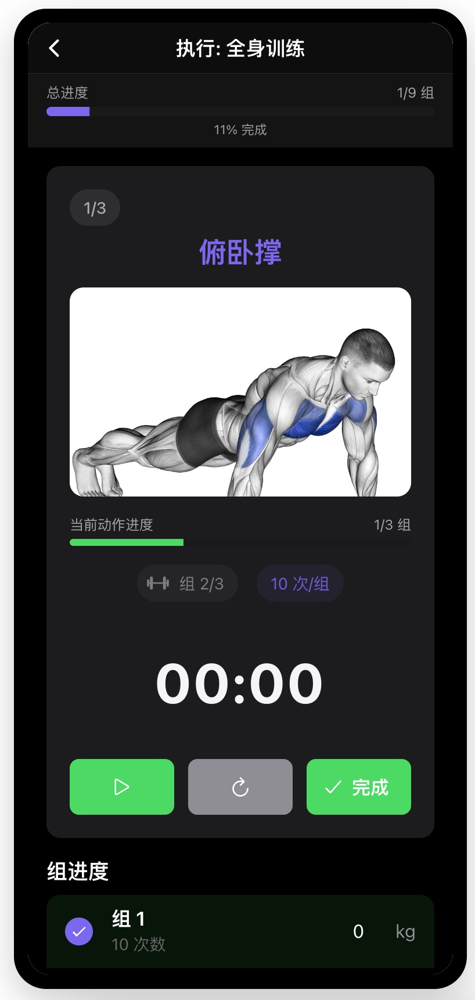

# 🌟 Awesome MorphixAI Apps

> 精选 MorphixAI 应用集合 - 快速开发、统一管理

<div align="center">

[](https://github.com/Morphicai/awesome-morphix-apps)
[](LICENSE)

[](https://x.com/MorphixAI)
[](https://discord.gg/HTknmpUM)
[](https://www.reddit.com/r/MorphixAI/)

[English](README.md) | [한국어](README_KR.md) | [日本語](README_JA.md)

</div>

## 📖 项目概述

这是一个 **MorphixAI 应用集合管理项目**，用于统一管理多个高质量的 MorphixAI 应用。

### ✨ 核心特性

- 🚀 **快速创建** - 一键创建新应用项目
- 🎯 **统一管理** - 集中管理所有应用和依赖
- 🛠️ **开发工具** - 完整的 CLI 工具链支持

### 🔗 与 @morphixai/code 的关系

本项目使用 [@morphixai/code](https://github.com/Morphicai/morphixai-code) 作为创建 MorphixAI 应用的底层框架。`@morphixai/code` 包提供：

- 应用模板和脚手架
- 开发环境设置
- 构建和部署工具
- MorphixAI 平台集成

有关框架的详细文档，请访问 [官方 @morphixai/code 仓库](https://github.com/Morphicai/morphixai-code)。

## 📚 可用应用

| 名称 | 描述 | 作者 | 功能特性 | 截图 | 演示 | 详情 |
|------|------|------|----------|------|------|------|
| ⏰ **timer** | 番茄钟应用 - 任务管理 + 番茄工作法 | MorphixAI Team | • 任务管理系统<br>• 番茄钟计时器<br>• 数据统计分析<br>• 多语言支持（中/英） |  | [在线演示 →](https://app-shell.focusbe.com/app/1219e970-e531-4157-bce9-e8f4dcaaf6a6#/) | [查看详情 →](https://github.com/Morphicai/awesome-morphix-apps/blob/main/apps/timer/README.md) |
| 📊 **mermaid** | Mermaid 图表编辑器 - 创建和编辑各种图表 | MorphixAI Team | • 多种图表类型<br>• 版本管理<br>• 实时预览<br>• 导出功能 |  | [在线演示 →](https://app-shell.focusbe.com/app/244975ac-609a-4a12-a02f-88d1512e9b60) | [查看详情 →](https://github.com/Morphicai/awesome-morphix-apps/blob/main/apps/mamerid/README.md) |
| 🤔 **百万问AI** | 基于人工智能的商业想法分析和决策支持工具 | MorphixAI Team | • 黄金提问清单生成<br>• AI大师推荐<br>• 行动蓝图<br>• 虚拟董事会<br>• 分享到社交媒体 |  | [在线演示 →](https://app-shell.focusbe.com/app/百万问ai-287d31ea-74d9-4cb4-9c48-37857d099358#/) | [查看详情 →](https://github.com/Morphicai/awesome-morphix-apps/blob/main/apps/million-questions-ai/README.md) |
| 💪 **fitness** | 健身助手 - 健身计划制定和训练追踪应用 | MorphixAI Team | • 创建健身计划<br>• 运动追踪<br>• 日历安排<br>• 统计仪表板<br>• 多语言支持 |  | [在线演示 →](https://app-shell.focusbe.com/app/ac5ba95d-a32c-4802-af26-e5f228c035ca) | [查看详情 →](https://github.com/Morphicai/awesome-morphix-apps/blob/main/apps/fitness/README.md) |
| 🔮 **soul-code-interpretation** | 心灵密码解读 - 九型人格测试与灵魂分析应用 | MorphixAI Community | • 九型人格测试<br>• 星座分析<br>• AI智能洞察<br>• 能量值计算<br>• 成长轨迹追踪 |  | [在线演示 →](#) | [查看详情 →](https://github.com/Morphicai/awesome-morphix-apps/blob/main/apps/soul-code-interpretation/README.md) |

> 📝 **注意**: 演示链接使用格式 `https://app-shell.focusbe.com/app/{remoteId}`

## 📁 项目结构

> 🎯 基于 pnpm monorepo 架构，统一管理所有应用和工具

```
awesome-morphix-apps/
├── apps/                  # 📱 所有应用
│   └── timer/             # ⏰ 番茄钟应用
│       ├── src/app/       # 任务管理 + 番茄钟功能
│       ├── src/_dev/      # 开发环境外壳
│       └── docs/          # 项目文档
│
├── tools/                 # 🛠️ 开发工具
│   └── cli/               # CLI 工具包
│       ├── bin/
│       │   └── morphix.js # 统一 CLI 入口
│       ├── create-app.js  # 创建新应用
│       ├── sync-docs.js   # 同步文档
│       └── dev.js         # 开发服务器
│
├── docs/                  # 📚 共享文档
│   ├── CONTRIBUTING.md    # 贡献指南
│   └── QUICK_START.md     # 快速开始指南
│
├── pnpm-workspace.yaml    # pnpm workspace 配置
├── package.json           # 根项目配置
└── README.md              # 本文件
```

## 🚀 快速开始

### 环境要求

- **Node.js** 18+ (推荐 LTS 版本)
- **Git**
- 支持的操作系统：macOS, Windows, Linux

> 💡 **无需全局安装 pnpm**  
> 项目包含 pnpm，直接使用 `pnpm` 命令即可

### 安装

```bash
# 克隆仓库
git clone git@github.com:Morphicai/awesome-morphix-apps.git
cd awesome-morphix-apps

# 安装所有依赖（包括所有应用和 pnpm）
pnpm install
```

## 🛠️ 项目管理

### 创建新应用

使用 CLI 工具快速创建新的 MorphixAI 应用：

```bash
# 交互式创建
npm run create

# 或直接指定应用名称
npm run create my-awesome-app
```

创建过程会：
1. ✅ 使用 `npx @morphixai/code create` 创建应用
2. ✅ 确保应用创建在 `apps/` 目录下
3. ✅ 自动生成项目结构和配置
4. ✅ 自动安装依赖
5. ✅ 初始化开发环境

### 开发应用

**方式一：交互式开发（推荐）**

在根目录运行，会显示菜单让你选择：

```bash
npm run dev
```

交互式菜单支持：
- 📱 使用 ↑↓ 方向键选择应用
- ➕ 创建新应用
- ❌ 退出

**方式二：直接进入子项目**

```bash
cd apps/timer
pnpm install
npm run dev
```

浏览器会自动打开 `http://localhost:8812`

## 🎯 开发规范

所有应用必须遵循统一的开发标准：

### 核心约束

- ✅ **开发区域**：只能在 `src/app/` 目录内开发
- ❌ **禁止修改**：不能修改 `src/_dev/`、配置文件和构建脚本
- 📦 **技术栈**：React 19 + Ionic React 8.6.2
- 🎨 **样式**：必须使用 CSS Modules
- 🔒 **入口文件**：`src/app/app.jsx`

### 推荐工具

- **Cursor AI** - 内置完整的开发规范
- **Claude Code** - 支持自然语言编程
- **VS Code** - 配合 Vite 插件

## 📦 发布流程

### 开发环境测试

```bash
cd your-app
npm run dev
```

### 发布到 MorphixAI 平台

1. **方式一：手动发布**
   - 在开发环境的控制面板点击"上传应用"
   - 填写应用信息并提交审核

2. **方式二：官方市场**
   - 发送邮件到 `contact@baibian.app`
   - 提供应用信息和使用说明

## 🔧 CLI 命令

### Monorepo 命令

> 💡 脚本使用 `npm`，安装使用 `pnpm`

```bash
# 🎯 交互式开发（推荐）
npm run dev              # 显示菜单选择项目

# 创建新应用
npm run create [name]

# 同步文档
npm run sync-docs [app]

# 安装所有依赖
pnpm install

# 清理所有 node_modules
npm run clean
```

### 子项目命令

```bash
# 🎯 推荐：使用交互式命令
npm run dev                        # 选择要开发的项目

# 在根目录使用 pnpm 过滤器
pnpm --filter timer dev            # 开发特定应用

# 或进入子项目
cd apps/timer
pnpm install                       # 安装依赖
npm run dev                        # 启动开发服务器
npm run generate-id                # 生成项目 ID
```

## 🤝 贡献指南

欢迎贡献新的应用或改进现有应用！

### 贡献流程

1. Fork 本仓库
2. 为你的功能创建新分支
   ```bash
   git checkout -b feature/my-new-app
   ```
3. 创建新应用或改进现有应用
   ```bash
   npm run create my-app
   cd apps/my-app
   # 开始开发...
   ```
4. 提交你的更改
   ```bash
   git add .
   git commit -m "feat(my-app): 添加新应用"
   ```
5. 推送到你的分支
   ```bash
   git push origin feature/my-new-app
   ```
6. 从你的分支创建 Pull Request 到主分支

### 应用质量要求

- ✅ 代码符合开发标准
- ✅ 提供完整的文档
- ✅ 在开发环境测试通过
- ✅ 遵循 MorphixAI 平台约束
- ✅ 具有实用价值

## 📖 相关资源

### 官方文档
- [MorphixAI 官网](https://baibian.app/)
- [@morphixai/code 框架](https://github.com/Morphicai/morphixai-code)
- [应用市场](https://app-shell.focusbe.com/app-market)

### 技术文档
- [React 官方文档](https://react.dev/)
- [Ionic React](https://ionicframework.com/docs/react)
- [Vite 文档](https://vitejs.dev/)

### 社区
- GitHub Issues - 问题反馈
- GitHub Discussions - 技术讨论
- Email: contact@baibian.app

### 社交媒体
- [Twitter/X](https://x.com/MorphixAI) - 最新更新和公告
- [Discord](https://discord.gg/HTknmpUM) - 社区聊天和支持
- [Reddit](https://www.reddit.com/r/MorphixAI/) - 社区讨论
- [小红书 (Xiaohongshu)](https://www.xiaohongshu.com/user/profile/585f9bb150c4b429edd4224e) - 中文社区
- [抖音 (Douyin)](https://v.douyin.com/qr4TImD9qZ0/) - 视频内容和教程

## 📄 许可证

本项目采用 [MIT License](LICENSE) 开源协议。

---

<div align="center">

**Made with ❤️ by MorphixAI Community**

[⬆ 回到顶部](#-awesome-morphixai-apps)

</div>
