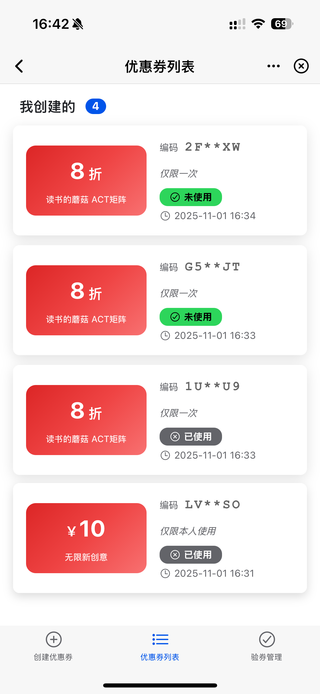

# 🌟 Awesome MorphixAI Apps

> 엄선된 MorphixAI 애플리케이션 컬렉션 - 빠른 개발, 통합 관리

<div align="center">

[](https://github.com/Morphicai/awesome-morphix-apps)
[](LICENSE)

[](https://x.com/MorphixAI)
[](https://discord.gg/HTknmpUM)
[](https://www.reddit.com/r/MorphixAI/)

[English](README.md) | [中文](README_CN.md) | [日本語](README_JA.md)

</div>

## 📖 프로젝트 개요

이것은 여러 고품질 MorphixAI 애플리케이션의 통합 관리를 위한 **MorphixAI 애플리케이션 컬렉션 관리 프로젝트**입니다.

### ✨ 핵심 기능

- 🚀 **빠른 생성** - 원클릭으로 새 애플리케이션 프로젝트 생성
- 🎯 **통합 관리** - 모든 애플리케이션과 의존성의 중앙 집중식 관리
- 🛠️ **개발 도구** - 완전한 CLI 도구체인 지원

### 🔗 @morphixai/code와의 관계

이 프로젝트는 MorphixAI 애플리케이션 생성을 위한 기본 프레임워크로 [@morphixai/code](https://github.com/Morphicai/morphixai-code)를 사용합니다. `@morphixai/code` 패키지는 다음을 제공합니다:

- 애플리케이션 템플릿 및 스캐폴딩
- 개발 환경 설정
- 빌드 및 배포 도구
- MorphixAI 플랫폼 통합

프레임워크에 대한 자세한 문서는 [공식 @morphixai/code 저장소](https://github.com/Morphicai/morphixai-code)를 방문하세요.

## 📚 사용 가능한 애플리케이션

| 이름 | 설명 | 작성자 | 기능 | 스크린샷 | 데모 | 세부사항 |
|------|------|--------|------|----------|------|----------|
| ⏰ **timer** | 포모도로 타이머 애플리케이션 - 작업 관리 + 포모도로 기법 | MorphixAI Team | • 작업 관리 시스템<br>• 포모도로 타이머<br>• 데이터 통계<br>• 다국어 지원 (EN/CN) |  | [라이브 데모 →](https://app-shell.focusbe.com/app/1219e970-e531-4157-bce9-e8f4dcaaf6a6#/) | [세부사항 보기 →](./apps/timer/README.md) |
| 📊 **mermaid** | Mermaid 다이어그램 편집기 - 다양한 다이어그램 생성 및 편집 | MorphixAI Team | • 다양한 다이어그램 유형<br>• 버전 관리<br>• 실시간 미리보기<br>• 내보내기 기능 |  | [라이브 데모 →](https://app-shell.focusbe.com/app/244975ac-609a-4a12-a02f-88d1512e9b60) | [세부사항 보기 →](./apps/mamerid/README.md) |
| 🤔 **Million Questions AI** | AI 기반 비즈니스 아이디어 분석 및 의사결정 지원 도구 | MorphixAI Team | • 골든 질문 리스트 생성<br>• AI 멘토 추천<br>• 액션 블루프린트<br>• 가상 이사회<br>• 소셜 미디어 공유 |  | [라이브 데모 →](https://app-shell.focusbe.com/app/百万问ai-287d31ea-74d9-4cb4-9c48-37857d099358#/) | [세부사항 보기 →](./apps/million-questions-ai/README.md) |
| 💪 **fitness** | 피트니스 어시스턴트 - 운동 계획 및 추적 애플리케이션 | MorphixAI Team | • 운동 계획 생성<br>• 운동 추적<br>• 캘린더 스케줄링<br>• 통계 대시보드<br>• 다국어 지원 |  | [라이브 데모 →](https://app-shell.focusbe.com/app/ac5ba95d-a32c-4802-af26-e5f228c035ca) | [세부사항 보기 →](https://github.com/Morphicai/awesome-morphix-apps/blob/main/apps/fitness/README.md) |
| 🔮 **soul-code-interpretation** | 소울 코드 해석 - 에니어그램 테스트 및 영혼 분석 앱 | MorphixAI Community | • 에니어그램 성격 테스트<br>• 별자리 분석<br>• AI 지능형 통찰<br>• 에너지 값 계산<br>• 성장 궤적 추적 |  | [라이브 데모 →](#) | [세부사항 보기 →](https://github.com/Morphicai/awesome-morphix-apps/blob/main/apps/soul-code-interpretation/README.md) |
| 🎫 **code-manager** | 쿠폰 관리 시스템 - 쿠폰 생성, 검증 및 관리 | MorphixAI Team | • 단일/일괄 쿠폰 생성<br>• QR 코드 검증<br>• 이미지 생성<br>• 클라우드 스토리지<br>• 탭 기반 탐색 |  | [라이브 데모 →](https://app-shell.focusbe.com/app/d7d89e52-858c-4d73-9327-42a646afc12b) | [세부사항 보기 →](https://github.com/Morphicai/awesome-morphix-apps/blob/main/apps/code-manager/README.md) |

> 📝 **참고**: 데모 링크는 `https://app-shell.focusbe.com/app/{remoteId}` 형식을 사용합니다

## 📁 프로젝트 구조

> 🎯 모든 애플리케이션과 도구의 통합 관리를 위한 pnpm monorepo 아키텍처 기반

```
awesome-morphix-apps/
├── apps/                  # 📱 모든 애플리케이션
│   └── timer/             # ⏰ 포모도로 타이머 애플리케이션
│       ├── src/app/       # 작업 관리 + 포모도로 기능
│       ├── src/_dev/      # 개발 환경 셸
│       └── docs/          # 프로젝트 문서
│
├── tools/                 # 🛠️ 개발 도구
│   └── cli/               # CLI 툴킷
│       ├── bin/
│       │   └── morphix.js # 통합 CLI 진입점
│       ├── create-app.js  # 새 애플리케이션 생성
│       ├── sync-docs.js   # 문서 동기화
│       └── dev.js         # 개발 서버
│
├── docs/                  # 📚 공유 문서
│   ├── CONTRIBUTING.md    # 기여 가이드
│   └── QUICK_START.md     # 빠른 시작 가이드
│
├── pnpm-workspace.yaml    # pnpm workspace 구성
├── package.json           # 루트 프로젝트 구성
└── README.md              # 이 파일
```

## 🚀 빠른 시작

### 요구사항

- **Node.js** 18+ (LTS 버전 권장)
- **Git**
- 지원 OS: macOS, Windows, Linux

> 💡 **pnpm을 전역으로 설치할 필요 없음**  
> 프로젝트에 pnpm이 포함되어 있으므로 `pnpm` 명령을 직접 사용하세요

### 설치

```bash
# 저장소 클론
git clone git@github.com:Morphicai/awesome-morphix-apps.git
cd awesome-morphix-apps

# 모든 의존성 설치 (모든 애플리케이션과 pnpm 포함)
pnpm install
```

## 🛠️ 프로젝트 관리

### 새 애플리케이션 생성

CLI 도구를 사용하여 새 MorphixAI 애플리케이션을 빠르게 생성:

```bash
# 대화형 생성
npm run create

# 또는 애플리케이션 이름을 직접 지정
npm run create my-awesome-app
```

생성 과정:
1. ✅ `npx @morphixai/code create`를 사용하여 애플리케이션 생성
2. ✅ 애플리케이션이 `apps/` 디렉토리에 생성되도록 보장
3. ✅ 프로젝트 구조와 구성을 자동 생성
4. ✅ 의존성 자동 설치
5. ✅ 개발 환경 초기화

### 애플리케이션 개발

**방법 1: 대화형 개발 (권장)**

루트 디렉토리에서 실행하면 선택 메뉴가 표시됩니다:

```bash
npm run dev
```

대화형 메뉴 지원:
- 📱 ↑↓ 화살표 키로 애플리케이션 선택
- ➕ 새 애플리케이션 생성
- ❌ 종료

**방법 2: 직접 프로젝트 진입**

```bash
cd apps/timer
pnpm install
npm run dev
```

브라우저가 자동으로 `http://localhost:8812`를 엽니다

## 🎯 개발 가이드라인

모든 애플리케이션은 통합된 개발 표준을 따라야 합니다:

### 핵심 제약사항

- ✅ **개발 영역**: `src/app/` 디렉토리 내에서만 개발
- ❌ **수정 금지**: `src/_dev/`, 구성 파일, 빌드 스크립트 수정 불가
- 📦 **기술 스택**: React 19 + Ionic React 8.6.2
- 🎨 **스타일링**: CSS Modules 사용 필수
- 🔒 **진입점**: `src/app/app.jsx`

### 권장 도구

- **Cursor AI** - 완전한 개발 표준 내장
- **Claude Code** - 자연어 프로그래밍 지원
- **VS Code** - Vite 플러그인과 함께 사용

## 📦 배포 과정

### 개발 환경 테스트

```bash
cd your-app
npm run dev
```

### MorphixAI 플랫폼에 배포

1. **방법 1: 수동 배포**
   - 개발 환경 제어판에서 "애플리케이션 업로드" 클릭
   - 애플리케이션 정보를 입력하고 검토를 위해 제출

2. **방법 2: 공식 마켓플레이스**
   - `contact@baibian.app`로 이메일 발송
   - 애플리케이션 정보와 사용 설명서 제공

## 🔧 CLI 명령

### Monorepo 명령

> 💡 스크립트는 `npm`, 설치는 `pnpm` 사용

```bash
# 🎯 대화형 개발 (권장)
npm run dev              # 프로젝트 선택 메뉴 표시

# 새 애플리케이션 생성
npm run create [name]

# 문서 동기화
npm run sync-docs [app]

# 모든 의존성 설치
pnpm install

# 모든 node_modules 정리
npm run clean
```

### 하위 프로젝트 명령

```bash
# 🎯 권장: 대화형 명령 사용
npm run dev                        # 개발할 프로젝트 선택

# 루트 디렉토리에서 pnpm 필터 사용
pnpm --filter timer dev            # 특정 애플리케이션 개발

# 또는 하위 프로젝트로 진입
cd apps/timer
pnpm install                       # 의존성 설치
npm run dev                        # 개발 서버 시작
npm run generate-id                # 프로젝트 ID 생성
```

## 🤝 기여 가이드

새 애플리케이션 기여나 기존 애플리케이션 개선을 환영합니다!

### 기여 과정

1. 이 저장소를 Fork
2. 기능을 위한 새 브랜치 생성
   ```bash
   git checkout -b feature/my-new-app
   ```
3. 새 애플리케이션 생성 또는 기존 애플리케이션 개선
   ```bash
   npm run create my-app
   cd apps/my-app
   # 개발 시작...
   ```
4. 변경사항 커밋
   ```bash
   git add .
   git commit -m "feat(my-app): 새 애플리케이션 추가"
   ```
5. 브랜치에 푸시
   ```bash
   git push origin feature/my-new-app
   ```
6. 브랜치에서 메인 브랜치로 Pull Request 생성

### 애플리케이션 품질 요구사항

- ✅ 코드가 개발 표준을 따름
- ✅ 완전한 문서 제공
- ✅ 개발 환경에서 테스트 통과
- ✅ MorphixAI 플랫폼 제약사항 준수
- ✅ 실용적 가치 보유

## 📖 관련 자료

### 공식 문서
- [MorphixAI 공식 웹사이트](https://baibian.app/)
- [@morphixai/code 프레임워크](https://github.com/Morphicai/morphixai-code)
- [애플리케이션 마켓플레이스](https://app-shell.focusbe.com/app-market)

### 기술 문서
- [React 공식 문서](https://react.dev/)
- [Ionic React](https://ionicframework.com/docs/react)
- [Vite 문서](https://vitejs.dev/)

### 커뮤니티
- GitHub Issues - 버그 리포트 및 피드백
- GitHub Discussions - 기술 토론
- Email: contact@baibian.app

### 소셜 미디어
- [Twitter/X](https://x.com/MorphixAI) - 최신 업데이트 및 공지사항
- [Discord](https://discord.gg/HTknmpUM) - 커뮤니티 채팅 및 지원
- [Reddit](https://www.reddit.com/r/MorphixAI/) - 커뮤니티 토론
- [小红书 (Xiaohongshu)](https://www.xiaohongshu.com/user/profile/585f9bb150c4b429edd4224e) - 중국 커뮤니티
- [抖音 (Douyin)](https://v.douyin.com/qr4TImD9qZ0/) - 비디오 콘텐츠 및 튜토리얼

## 📄 라이선스

이 프로젝트는 [MIT License](LICENSE)에 따라 라이선스가 부여됩니다.

---

<div align="center">

**Made with ❤️ by MorphixAI Community**

[⬆ 맨 위로](#-awesome-morphixai-apps)

</div>
