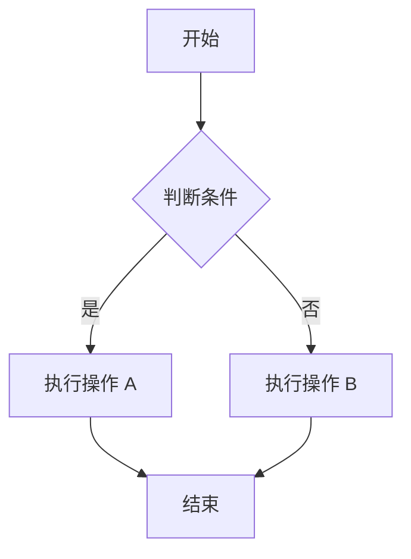
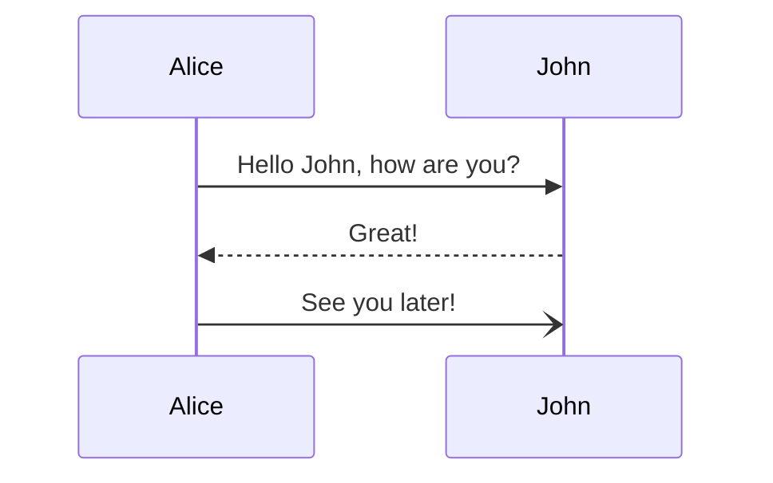
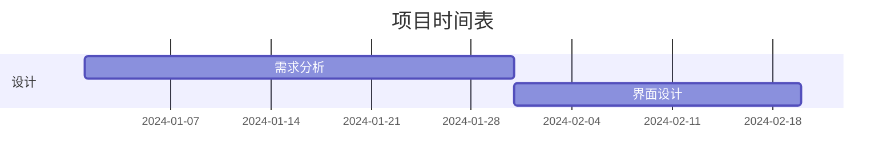
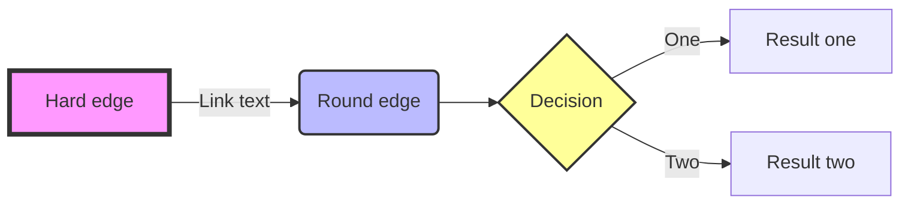

# Mermaid 预览器

一个功能完整的 Mermaid 图表预览应用，支持实时编辑和多版本切换。

## ✨ 功能特性

### 📊 图表类型支持
- **流程图 (Flowchart)** - 展示流程和决策逻辑
- **序列图 (Sequence Diagram)** - 展示对象间的交互序列
- **甘特图 (Gantt Chart)** - 展示项目时间表
- 支持所有 Mermaid 图表类型

### 🎨 界面特性
- **响应式布局**
  - 💻 PC 端：左右分栏布局（左侧编辑器，右侧预览）
  - 📱 移动端：上下分栏布局（上方编辑器，下方预览）
- **实时预览** - 输入代码即时渲染
- **深色模式** - 自动适配系统主题

### 🔧 实用功能
- **多版本支持** - 可切换不同 Mermaid 版本
  - v11.4.1 (Latest)
  - v11.0.0
  - v10.9.0
  - v10.0.0
- **示例模板** - 快速开始的示例代码
- **代码复制** - 一键复制当前代码
- **图表下载** - 导出为 SVG 格式
- **自动保存** - 本地保存代码和设置

## 🚀 快速开始

### 使用示例模板

应用内置了三种常用图表模板：

1. **流程图示例**


2. **序列图示例**


3. **甘特图示例**


### 自定义图表

在左侧编辑器中输入 Mermaid 语法，右侧会实时显示预览效果。

## 📱 布局说明

### PC 端布局
```
┌─────────────────────────────────────────┐
│           工具栏（示例/版本选择）         │
├──────────────────┬──────────────────────┤
│                  │                      │
│   代码编辑器      │      实时预览        │
│   (左侧 50%)     │     (右侧 50%)       │
│                  │                      │
└──────────────────┴──────────────────────┘
```

### 移动端布局
```
┌─────────────────────────────────────────┐
│           工具栏（示例/版本选择）         │
├─────────────────────────────────────────┤
│                                         │
│            代码编辑器                    │
│            (上方 50%)                   │
│                                         │
├─────────────────────────────────────────┤
│                                         │
│            实时预览                      │
│            (下方 50%)                   │
│                                         │
└─────────────────────────────────────────┘
```

## 🛠️ 技术栈

- **React 19** - UI 框架
- **Ionic React 8.6** - 移动端组件库
- **Mermaid.js** - 图表渲染引擎（支持多版本）
- **CSS Modules** - 样式管理
- **MorphixAI SDK** - 错误上报和数据持久化

## 🚀 核心特性

### 智能版本缓存

应用使用 `MermaidService` 服务层来管理 Mermaid 实例：

- **自动缓存** - 已加载的版本会自动缓存，切换回来时无需重新加载
- **并发控制** - 避免同一版本被重复加载
- **预加载机制** - 自动在后台预加载常用版本
- **缓存统计** - 可查看当前缓存状态

```javascript
// MermaidService 主要方法
MermaidService.loadMermaid(version)      // 加载指定版本（自动缓存）
MermaidService.getCachedVersions()       // 获取已缓存的版本
MermaidService.isCached(version)         // 检查版本是否已缓存
MermaidService.clearCache(version)       // 清除缓存
MermaidService.preloadVersions(versions) // 预加载多个版本
```

## 📖 使用说明

### 工具栏按钮

| 图标 | 功能 | 说明 |
|------|------|------|
| 🔄 | 刷新 | 手动重新渲染图表 |
| 📋 | 复制 | 复制当前代码到剪贴板 |
| 💾 | 下载 | 下载图表为 SVG 文件 |
| 🔖 | 保存 | 保存代码到本地存储 |

### 版本切换

通过顶部的版本选择器可以切换不同版本的 Mermaid：
- 不同版本可能支持不同的图表类型和语法
- 切换版本后会自动重新渲染图表
- 版本信息会显示在预览区域的右上角

### 数据持久化

应用会自动保存以下内容到本地：
- 当前编辑的代码
- 选择的 Mermaid 版本
- 选择的示例模板

刷新页面后会自动恢复上次的状态。

## 🎓 Mermaid 语法资源

### 官方资源
- [Mermaid 官网](https://mermaid.js.org)
- [GitHub 仓库](https://github.com/mermaid-js/mermaid)
- [在线编辑器](https://mermaid.live)
- [完整文档](https://mermaid.js.org/intro/)

### 常用图表类型

1. **流程图** - `graph` / `flowchart`
2. **序列图** - `sequenceDiagram`
3. **类图** - `classDiagram`
4. **状态图** - `stateDiagram`
5. **甘特图** - `gantt`
6. **饼图** - `pie`
7. **实体关系图** - `erDiagram`
8. **用户旅程图** - `journey`
9. **Git 图** - `gitGraph`

## 🔍 示例：高级流程图



## 📝 开发说明

### 项目结构
```
src/
├── app.jsx              # 主应用组件
├── services/
│   └── MermaidService.js # Mermaid 加载和缓存服务
└── styles/
    └── App.module.css   # 应用样式（支持响应式）
```

### 响应式断点
- **桌面端**: > 768px (左右布局)
- **移动端**: ≤ 768px (上下布局)
- **小屏幕**: ≤ 480px (进一步优化)

### 自定义配置

编辑 `app.jsx` 中的配置：

```javascript
// 修改默认示例代码
const EXAMPLE_FLOWCHART = `你的代码`;

// 添加新的 Mermaid 版本
const MERMAID_VERSIONS = [
    { version: 'x.x.x', label: 'vx.x.x', url: 'CDN URL' }
];
```

## 🐛 故障排除

### 图表无法渲染
1. 检查 Mermaid 语法是否正确
2. 尝试切换到其他版本
3. 点击刷新按钮手动重新渲染
4. 查看错误提示信息

### 移动端布局问题
- 应用会自动在 768px 以下切换为上下布局
- 支持横屏和竖屏自动适配

### 保存功能失效
- 应用使用 localStorage 保存数据
- 确保浏览器允许使用本地存储
- 隐私模式可能限制本地存储功能

## 🎯 最佳实践

1. **使用示例模板快速开始** - 选择相应的图表类型作为起点
2. **定期保存工作** - 点击保存按钮确保数据持久化
3. **版本兼容性** - 复杂图表建议使用最新版本
4. **代码格式化** - 保持代码缩进和结构清晰
5. **移动端编辑** - 建议在 PC 端编辑复杂图表

## 🌟 特色功能

### 实时预览
代码输入后 500ms 自动渲染，无需手动刷新。

### 错误提示
当 Mermaid 语法错误时，会在预览区域显示详细的错误信息。

### 深色模式
自动检测系统主题设置，提供舒适的夜间使用体验。

### 响应式设计
从手机到大屏幕，在任何设备上都能获得最佳体验。

## 📄 许可证

本项目基于 MIT 许可证开源。

Mermaid.js 也是基于 MIT 许可证的开源项目。

## 🔗 相关链接

- [Mermaid 官方文档](https://mermaid.js.org)
- [Mermaid GitHub](https://github.com/mermaid-js/mermaid)
- [Mermaid Live Editor](https://mermaid.live)
- [MorphixAI 开发指南](docs/DEVELOPMENT_GUIDE.md)

---

**享受使用 Mermaid 创建精美图表！** 🎨✨
