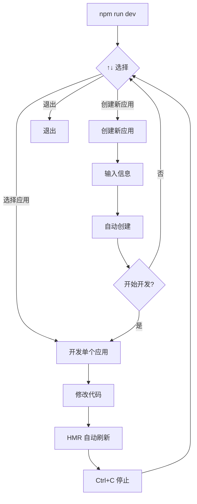

# 🎯 开发指南

## 交互式开发模式

### 启动交互式开发

```bash
npm run dev
```

### 界面示例

```
🎯 MorphixAI 交互式开发环境

? 选择要开发的应用 › (使用 ↑↓ 键选择，回车确认)
❯ timer - 番茄钟应用（花园仙子主题）
  todo - 待办事项管理
  calculator - 计算器应用
  ➕ 创建新应用
  ❌ 退出
```

### 操作说明

#### 1️⃣ 选择现有项目开发

使用 ↑↓ 方向键选择项目，按回车确认，即可启动该项目的开发服务器：

```bash
? 选择要开发的应用 › timer

🚀 启动开发服务器: timer
ℹ 项目路径: /path/to/apps/timer
ℹ 浏览器将自动打开 http://localhost:8812

============================================================
按 Ctrl+C 停止开发服务器
============================================================

  VITE v5.x.x  ready in xxx ms

  ➜  Local:   http://localhost:8812/
  ➜  Network: use --host to expose
```

**特点：**
- ✅ 自动打开浏览器
- ✅ 热模块替换（HMR）
- ✅ 停止后自动返回菜单
- ✅ 实时错误提示

#### 2️⃣ 创建新应用

选择 "➕ 创建新应用" 选项进入创建流程：

```bash
? 选择要开发的应用 › ➕ 创建新应用

📱 创建新的 MorphixAI 应用

✓ 输入应用名称: my-awesome-app
✓ 输入应用描述: 一个很棒的应用
✓ 输入作者名: Your Name

🚀 开始创建应用...
✓ 复制模板文件
✓ 生成项目 ID
✓ 更新配置文件
✓ 安装依赖

✅ 应用创建成功！

要开始开发吗？(Y/n): y
```

创建完成后可以：
- 立即开始开发
- 返回菜单选择其他操作

#### 3️⃣ 退出

选择 "❌ 退出" 或按 `Ctrl+C` 退出交互式开发环境：

```bash
? 选择要开发的应用 › ❌ 退出

ℹ 再见！👋
```

## 其他开发方式

### 方式一：并行运行所有应用（适合测试）

```bash
npm run dev:all
```

**注意：**
- ⚠️ 会同时启动所有应用
- ⚠️ 占用较多系统资源
- 适合：测试应用间交互

### 方式二：运行特定应用

```bash
npx pnpm --filter timer dev
```

适合：确定要开发某个特定应用时

### 方式三：进入子项目

```bash
cd apps/timer
npm install
npm run dev
```

适合：长时间专注开发某个应用

## 开发工作流

### 典型开发流程



### 推荐工作流

1. **启动开发环境**
   ```bash
   npm run dev
   ```

2. **选择要开发的应用**
   - 首次开发：选择 "➕ 创建新应用"
   - 继续开发：用 ↑↓ 选择应用，回车确认

3. **开发调试**
   - 修改代码
   - 浏览器自动刷新
   - 查看控制台错误

4. **切换应用**
   - `Ctrl+C` 停止当前应用
   - 自动返回菜单
   - 选择其他应用继续开发

5. **完成开发**
   - 选择 "❌ 退出" 或按 `Ctrl+C`

## 快捷键

在开发服务器运行时：

**在选择菜单中：**

| 快捷键 | 功能 |
|--------|------|
| `↑` / `↓` | 上下选择 |
| `Enter` | 确认选择 |
| `Ctrl+C` | 退出 |

**在开发服务器运行时：**

| 快捷键 | 功能 |
|--------|------|
| `Ctrl+C` | 停止服务器并返回菜单 |
| `r` | 手动重启服务器 |
| `o` | 在浏览器中打开 |
| `q` | 退出 Vite CLI |

## 常见问题

### Q: 如何同时开发多个应用？

**A:** 有两种方式：

1. **使用并行模式**（推荐用于测试）：
   ```bash
   npm run dev:all
   ```

2. **开启多个终端**（推荐用于开发）：
   ```bash
   # 终端 1
   cd apps/timer && npm run dev
   
   # 终端 2  
   cd apps/todo && npm run dev
   ```

### Q: 端口被占用怎么办？

**A:** Vite 会自动使用下一个可用端口，或者你可以在 `vite.config.js` 中指定：

```js
export default defineConfig({
  server: {
    port: 8813, // 自定义端口
  }
})
```

### Q: 开发服务器无法停止？

**A:** 尝试以下方法：

1. 按 `Ctrl+C` 两次快速停止
2. 使用 `kill` 命令：
   ```bash
   # 查找进程
   lsof -i :8812
   
   # 杀死进程
   kill -9 <PID>
   ```

### Q: 如何查看所有可用的应用？

**A:** 运行 `npm run dev` 后会自动列出所有可开发的应用。

### Q: 创建的新应用在哪里？

**A:** 在 `apps/<your-app-name>/` 目录下。

## 调试技巧

### 1. 使用浏览器开发者工具

```
F12 或 Cmd+Option+I (Mac)
```

- **Console**: 查看日志和错误
- **Network**: 检查 API 请求
- **Elements**: 调试样式和 DOM
- **React DevTools**: 检查组件状态

### 2. Vite 开发服务器日志

开发服务器会显示：
- ✅ 编译成功
- ❌ 编译错误
- 🔄 HMR 更新
- 📦 依赖预构建

### 3. 使用 console.log

```jsx
// 在组件中
useEffect(() => {
  console.log('Component mounted', { state, props });
}, []);
```

### 4. React DevTools Profiler

分析组件性能：
1. 打开 React DevTools
2. 切换到 Profiler 标签
3. 点击录制按钮
4. 操作应用
5. 停止录制查看性能报告

## 最佳实践

### ✅ 推荐

- 使用交互式开发模式 `npm run dev`
- 专注一个应用时使用单应用开发
- 定期运行 `npm run sync-docs` 同步文档
- 使用 Git 分支管理不同应用的开发
- 及时提交代码变更

### ❌ 不推荐

- 不要同时运行所有应用（除非必要）
- 不要修改 `apps/template/` 目录（这是模板）
- 不要手动修改生成的 Project ID
- 不要忽略 ESLint/TypeScript 错误

## 资源链接

- [Vite 文档](https://vitejs.dev/)
- [React 文档](https://react.dev/)
- [Ionic React 文档](https://ionicframework.com/docs/react)
- [MorphixAI 官方文档](https://docs.morphix.ai/)

---

**提示**：首次使用建议先运行 `npm run dev`，熟悉交互式开发流程！

